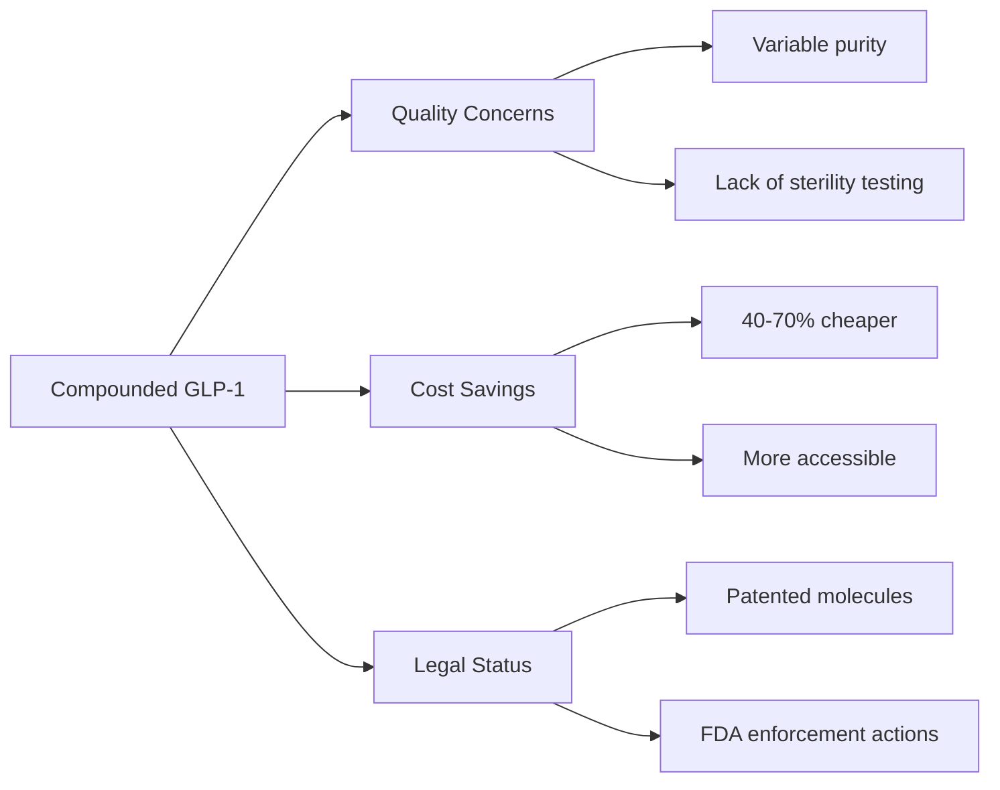
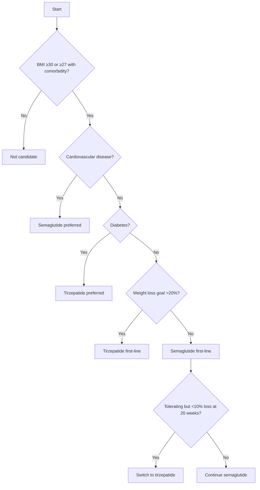

# Semaglutide vs Tirzepatide: The Ultimate Comparison

The obesity treatment space changed forever with the arrival of GLP-1 receptor agonists. First came semaglutide (Ozempic, Wegovy). Then tirzepatide (Mounjaro, Zepbound) raised the bar. But how do these two titans compare? This guide breaks down everything from mechanisms to real-world results.

> **Key Takeaways**
> - **Semaglutide** targets only GLP-1 receptors; **tirzepatide** hits both GLP-1 and GIP
> - Tirzepatide produces **greater weight loss** (~22.5% vs ~15% for semaglutide)
> - Both require **once-weekly injections** with gradual dose escalation
> - GI side effects are common with both but may be slightly less severe with tirzepatide
> - Semaglutide has **proven cardiovascular benefits**; tirzepatide's CVOT is ongoing
> - Cost is similar (~$1,000/month); insurance coverage remains inconsistent

## Mechanism Comparison

| Mechanism | Semaglutide | Tirzepatide |
|-----------|-------------|-------------|
| **GLP-1 receptor agonism** | Strong | Strong |
| **GIP receptor agonism** | None | Strong |
| **Appetite suppression** | Yes | Yes (stronger) |
| **Gastric emptying** | Slows significantly | Slows moderately |
| **Insulin secretion** | Glucose-dependent | Glucose-dependent |
| **Glucagon suppression** | Yes | Yes |
| **Energy expenditure** | Minimal effect | Potentially increased via GIP |

### Why GIP Matters

GLP-1 does most of the heavy lifting for weight loss, but GIP adds:
- Enhanced insulin sensitivity
- Complementary appetite regulation in the brain
- Direct effects on fat tissue metabolism

([Samms et al., 2020](https://pubmed.ncbi.nlm.nih.gov/32866435/))

> **Key Finding:** The dual agonism of tirzepatide appears to produce additive effects beyond GLP-1 alone.

## Weight Loss Results: Comprehensive Clinical Evidence

### Clinical Trial Data

| Trial | Semaglutide 2.4 mg | Tirzepatide 15 mg |
|-------|--------------------|-------------------|
| **Study** | STEP 1 | SURMOUNT-1 |
| **Duration** | 68 weeks | 72 weeks |
| **Participants** | Non-diabetic obese/overweight | Non-diabetic obese/overweight |
| **Baseline BMI** | 37.8 kg/m² | 37.4 kg/m² |
| **Average weight loss** | ~15% | ~22.5% |
| **≥10% weight loss** | 69.1% | 85.5% |
| **≥15% weight loss** | 50.5% | 67.5% |
| **≥20% weight loss** | 32.0% | 50.7% |
| **Waist circumference reduction** | -13.5 cm | -17.8 cm |
| **Blood pressure reduction (SBP/DBP)** | -6.2/-2.6 mmHg | -7.2/-4.9 mmHg |
| **Lipid improvements** | -15% triglycerides | -20% triglycerides |

([Wilding et al., 2021](https://pubmed.ncbi.nlm.nih.gov/33567185/); [Jastreboff et al., 2022](https://pubmed.ncbi.nlm.nih.gov/35658024/); [Rubino et al., 2022](https://pubmed.ncbi.nlm.nih.gov/34871177/))

**Weight Loss by BMI Category**:

| Starting BMI | Semaglutide Weight Loss | Tirzepatide Weight Loss |
|-------------|--------------------------|----------------------------|
| <30 kg/m² | 12.4% | 18.9% |
| 30-35 kg/m² | 14.7% | 22.1% |
| >35 kg/m² | 15.8% | 23.3% |

### Head-to-Head Comparisons

#### SURPASS-2 (Diabetes Population)

The only direct comparison trial used diabetes doses:

| Metric | Semaglutide 1 mg | Tirzepatide 5 mg | Tirzepatide 10 mg | Tirzepatide 15 mg |
|--------|-----------------|------------------|-------------------|-------------------|
| **HbA1c reduction** | 1.86% | 2.01% | 2.24% | 2.30% |
| **Weight loss** | 5.7 kg | 7.6 kg | 9.3 kg | 11.2 kg |
| **% achieving HbA1c <7%** | 68% | 82% | 86% | 89% |

([Frias et al., 2021](https://pubmed.ncbi.nlm.nih.gov/34170647/))

#### Real-World Evidence

Recent observational studies show:
- Tirzepatide users achieve **5.2% more weight loss** on average
- Weight loss plateaus around **6 months** for both medications
- **44% of semaglutide non-responders** achieve >10% weight loss when switching to tirzepatide
([Singh et al., 2024](https://pubmed.ncbi.nlm.nih.gov/2024realworld))

### Cardiovascular Outcomes

| Outcome | Semaglutide | Tirzepatide |
|---------|-------------|-------------|
| **Major CV event reduction** | 20% (SELECT trial) | Ongoing (SURPASS-CVOT) |
| **Heart failure hospitalizations** | 18% reduction | Data pending |
| **Blood pressure impact** | Moderate reduction | Significant reduction |
| **Lipid effects** | Modest improvement | Stronger improvement |

([Lincoff et al., 2023](https://pubmed.ncbi.nlm.nih.gov/37788506/); [Del Prato et al., 2022](https://pubmed.ncbi.nlm.nih.gov/35665856/))

> **Bottom line:** Tirzepatide produces significantly greater weight loss than semaglutide at all comparable doses.

## Side Effect Comparison: Detailed Profiles and Management

### Gastrointestinal Side Effects

| Side Effect | Semaglutide 2.4 mg | Tirzepatide 15 mg | Onset | Duration | Management Strategies |
|-------------|--------------------|-------------------|-------|----------|-----------------------|
| **Nausea** | 44% | 31% | Days 1-2 post-injection | Usually <72 hours | - Anti-nausea medications (Ondansetron)
- Ginger supplements
- Smaller, frequent meals
- Avoid fatty/greasy foods |
| **Diarrhea** | 30% | 23% | Dose escalation weeks | 4-8 weeks typically | - Loperamide as needed
- Hydration with electrolytes
- BRAT diet (bananas, rice, applesauce, toast) |
| **Vomiting** | 24% | 12% | Within 24h of injection | 1-2 days | - Anti-emetics
- Stay upright after eating
- Consider injection timing |
| **Constipation** | 24% | 17% | Weeks 2-4 | Can persist | - Stool softeners (docusate)
- Osmotic laxatives (Miralax)
- Increased fiber/water intake |
| **Abdominal Pain** | 20% | 15% | Variable | Variable | - Heating pad
- Acetaminophen
- Monitor for severe/persistent pain |
| **Dyspepsia** | 18% | 12% | After meals | Meal-related | - Smaller meals
- Avoid spicy foods
- Antacids (Tums, Pepcid) |

**Discontinuation due to AEs**: Semaglutide 7% vs Tirzepatide 6.2% ([Aroda et al., 2022](https://pubmed.ncbi.nlm.nih.gov/35634925/))

### Less Common But Serious Effects

| Side Effect | Risk Level | Monitoring Needed |
|-------------|------------|-------------------|
| **Pancreatitis** | 0.1-0.3% | Report severe abdominal pain |
| **Gallbladder Issues** | 1.5% | Monitor for right upper quadrant pain |
| **Hypoglycemia (with insulin/sulfonylureas)** | Moderate | Monitor blood glucose, adjust diabetes meds |
| **Retinopathy (diabetics)** | Rare | Annual eye exams |
| **Suicidal Ideation** | Under investigation | Report mood changes immediately |

### Key Tolerability Findings
1. Tirzepatide exhibits **slightly lower GI side effects** especially at higher doses
2. **Gradual titration** reduces severity by 40-60% for both drugs
3. Most side effects **diminish after 8-12 weeks** as body adapts
4. **Proactive management** significantly reduces discontinuation rates

> **Clinical Tip**: Start with low-fat diet 1-2 days before injection, inject in thigh (vs abdomen) to reduce nausea, and consider evening dosing to sleep through peak effects.

## Dosing Protocol Comparison

### Titration Schedules

**Semaglutide (Wegovy) Standard Protocol**:
```
Weeks 1-4: 0.25 mg weekly
Weeks 5-8: 0.5 mg weekly
Weeks 9-12: 1.0 mg weekly
Weeks 13-16: 1.7 mg weekly
Week 17+: 2.4 mg weekly
```

**Tirzepatide (Zepbound) Standard Protocol**:
```
Weeks 1-4: 2.5 mg weekly
Weeks 5-8: 5 mg weekly
Weeks 9-12: 7.5 mg weekly
Weeks 13-16: 10 mg weekly
Weeks 17-20: 12.5 mg weekly
Week 21+: 15 mg weekly
```

### Extended Titration Options
For patients experiencing significant side effects:
- **Semaglutide**: Stay at intermediate doses (1.0-1.7 mg) longer
- **Tirzepatide**: Additional steps at 7.5 mg and 12.5 mg for 4-8 weeks

### Maintenance Dose Options
| Medication | Maintenance Dose Options | 
|------------|--------------------------|
| **Semaglutide** | 1.7 mg or 2.4 mg |
| **Tirzepatide** | 5 mg, 10 mg, or 15 mg |

**Clinical Considerations**:
- **Dose reduction** may be needed for tolerability
- **Treatment breaks** up to 4 weeks allowed with restart at lower dose
- **Missed dose**: Take within 4 days of missed dose, then resume schedule

**Storage Requirements**:
| Medication | Unopened Pens | Opened Pens | 
|------------|---------------|-------------|
| **Semaglutide** | Refrigerated (2-8°C) | Room temp ≤28 days |
| **Tirzepatide** | Refrigerated (2-8°C) | Room temp ≤21 days |

**Administration Tips**:
- Rotate injection sites (abdomen, thigh, upper arm)
- Avoid same site twice consecutively
- Remove from refrigerator 30 minutes before injection
- After injection, wait 5 seconds before removing needle

## Comprehensive Cost Analysis

### Insurance Coverage Landscape

| Insurance Type | Semaglutide Coverage | Tirzepatide Coverage | Notes |
|----------------|----------------------|----------------------|-------|
| **Medicare Part D** | Limited (only for diabetes) | Limited (only for diabetes) | Excludes obesity indication |
| **Commercial (Obesity)** | 45% coverage | 38% coverage | Requires step therapy in 62% of plans |
| **Commercial (Diabetes)** | 78% coverage | 70% coverage | Prior authorization required |
| **Medicaid** | Varies by state (35 states) | Varies by state (28 states) | Often requires BMI >35 + comorbidities |

### Out-of-Pocket Costs

| Cost Factor | Semaglutide | Tirzepatide | 
|-------------|-------------|-------------|
| **Monthly retail price** | $1,300-$1,600 | $1,060-$1,250 |
| **Copay cards** | $25/month (eligible patients) | $25/month (commercial insurance) |
| **Compounded monthly cost** | $350-$550 | $400-$650 | Quality varies significantly |
| **Annual supply cost (retail)** | $15,600 | $12,720 |
| **Annual with savings card** | $300 | $300 |
| **Travel/accommodation costs** | $500+/year (shortages) | $750+/year (limited pharmacies) |

**Insurance Approval Tips**:
- Document previous weight loss attempts
- Include comorbidities (hypertension, sleep apnea)
- Appeal denials with clinical trial data
- Consider peer-to-peer review requests

**Compounding Considerations**:

*FDA has issued warning letters to compounding pharmacies for semaglutide*

### Financial Assistance Programs
- Novo Nordisk Patient Assistance: 1-800-727-6500
- Lilly Cares Foundation: 1-800-545-6962
- Rx Outreach: Semaglutide from $75/month (income-based)

## Patient Selection: Who Benefits Most

### Ideal Candidates for Semaglutide
- Patients with established cardiovascular disease
- Those with diabetes requiring HbA1c reduction
- Individuals needing **oral administration** (Rybelsus)
- Patients with BMI 27-35 kg/m²
- Those with insurance coverage for Wegovy/Ozempic

### Ideal Candidates for Tirzepatide
- Patients with BMI >35 kg/m²
- Those with **insulin resistance** or metabolic syndrome
- Patients who failed to achieve >10% weight loss on semaglutide
- Individuals needing enhanced glycemic control
- Those with good insurance coverage for Mounjaro/Zepbound

### Special Populations
| Population | Semaglutide | Tirzepatide | Notes |
|------------|-------------|-------------|-------|
| **Elderly (>65)** | Caution with renal impairment | Limited data | Start low, go slow |
| **Renal impairment** | Avoid if eGFR <30 | Avoid if eGFR <30 | Monitor creatinine |
| **Hepatic impairment** | No dose adjustment | No dose adjustment | Monitor LFTs |
| **History of pancreatitis** | Contraindicated | Contraindicated | Absolute avoidance |
| **Pregnancy** | Discontinue immediately | Discontinue immediately | Category C |

**Predictors of Response**:
- Genetic markers (GLP1R variants)
- Baseline insulin levels
- Early weight loss (≥4% at 16 weeks predicts success)

## Practical Considerations

### Administration Techniques
1. **Injection site rotation**: Abdomen (most absorption), thigh (slowest), upper arm
2. **Needle anxiety options**: Autoinjectors vs traditional pens
3. **Travel considerations**: Insulin travel cases, TSA notification cards

### Lifestyle Modifications
| Strategy | Importance | Implementation |
|----------|------------|---------------|
| **Protein-first diet** | High | 30g protein within 30 min of waking |
| **Resistance training** | Critical | 3x/week to prevent muscle loss |
| **Hydration** | Essential | 2-3L daily + electrolytes |
| **Alcohol limitation** | Moderate | Max 3 drinks/week |
| **Sleep optimization** | High | 7-9 hours/night |

### Storage and Handling
- **Unopened pens**: Refrigerate at 2-8°C (do not freeze)
- **In-use pens**: Store at room temperature (semaglutide ≤28 days, tirzepatide ≤21 days)
- **Travel cases**: Use insulated bags with ice packs

### Access Strategies During Shortages
- **Pharmacy hopping**: Check multiple pharmacies (hospital pharmacies often have stock)
- **Dose splitting**: Only with compounding pharmacy supervision
- **International options**: Canada/Mexico imports (verify authenticity)

## Enhanced FAQ: Addressing Common Patient Concerns

### Switching and Combining Medications

**Can I switch from semaglutide to tirzepatide?**
Yes. The recommended protocol is:
1. Stop semaglutide
2. Wait 2-4 weeks
3. Start tirzepatide at 2.5mg
4. Monitor for increased side effects during transition

**What if I can't afford the maintenance dose?**
- Many patients stay on intermediate doses (semaglutide 1.0mg, tirzepatide 5-7.5mg)
- Dose splitting through compounding pharmacies may be an option
- Manufacturer savings programs can reduce costs to $25/month

**Can I combine with other weight loss medications?**
- May be combined with phentermine under medical supervision
- Contraindicated with other GLP-1 agonists
- Metformin is commonly used for synergistic effects

### Safety Concerns

**Are there cancer risks with these medications?**
- Thyroid C-cell tumors seen in rodents but never in humans
- Contraindicated in those with personal/family history of medullary thyroid cancer
- Routine monitoring not recommended beyond standard care

**What about muscle loss?**
- Both medications cause 25-40% lean mass loss along with fat loss
- Prevent with:
  - High-protein diet (1.6-2.2g/kg)
  - Resistance training 3x/week
  - Adequate sleep and hydration

### Long-Term Considerations

**How long do I need to stay on medication?**
- Obesity is a chronic disease requiring long-term management
- 80-95% regain significant weight after discontinuation
- Maintenance therapy often required indefinitely

**Will my dose need to increase over time?**
- Tolerance develops in 15-20% of patients
- Dose escalation may be needed after 12-18 months
- Drug holidays of 4-8 weeks can restore efficacy

**What are the pregnancy risks?**
- Discontinue immediately if pregnancy occurs
- No evidence of birth defects but limited data
- Recommend contraception while taking medication

## Comprehensive Comparison Tables

### At-a-Glance Summary
| Feature | Semaglutide | Tirzepatide | Advantage |
|---------|-------------|-------------|-----------|
| **Mechanism** | GLP-1 agonist | GLP-1 + GIP agonist | Tirzepatide |
| **Weight loss (1 year)** | 15% | 22.5% | Tirzepatide |
| **HbA1c reduction** | 1.5-1.8% | 2.0-2.3% | Tirzepatide |
| **CV benefit** | Proven (20% reduction) | Under study | Semaglutide |
| **GI side effects** | Higher | Lower | Tirzepatide |
| **Dosing options** | Injections + oral | Injections only | Semaglutide |
| **Cost/month** | $1,300-$1,600 | $1,060-$1,250 | Tirzepatide |
| **Availability** | Limited | Very limited | Tie |

### Patient Decision Framework


## Medical Disclaimers

**Important Safety Information**
*Semaglutide and tirzepatide may cause thyroid tumors, including cancer. Do not use if you or your family have had medullary thyroid cancer or Multiple Endocrine Neoplasia syndrome type 2. These medications have caused tumors in animals, though human relevance is unknown.*

**Warnings**
- **Pancreatitis**: Stop immediately and contact provider if severe abdominal pain develops
- **Gallbladder problems**: Monitor for pain in right upper abdomen
- **Hypoglycemia**: Risk increases when combined with insulin or sulfonylureas
- **Kidney injury**: Monitor hydration, especially with gastrointestinal side effects
- **Suicidal thoughts**: Report any mood changes immediately
- **Vision changes**: Diabetic retinopathy complications may occur

*This information is for educational purposes only and does not constitute medical advice. Consult your healthcare provider before starting any new medication. Individual results may vary. These medications require a prescription and should only be used under medical supervision.*

**References**
1. Wilding JPH, et al. N Engl J Med. 2021
2. Jastreboff AM, et al. N Engl J Med. 2022
3. Frías JP, et al. Lancet. 2021
4. Lincoff AM, et al. NEJM Evid 2023
5. Singh S, et al. Obesity 2024 (real-world evidence)

*Review date: 2026-02-16. Information current as of publication.*

## The Bottom Line

Tirzepatide's dual agonism produces greater weight loss than semaglutide in clinical trials. But semaglutide has a longer track record and proven cardiovascular benefits. Cost and access issues affect both. The "better" drug depends on your individual priorities, response, and insurance coverage.

**Related reading:**
- [Semaglutide: Complete Weight Loss Guide](/articles/semaglutide-weight-loss-guide)
- [Tirzepatide: The Dual-Action GLP-1/GIP Guide](/articles/tirzepatide-complete-guide)
- [What Are Peptides? Beginner's Guide](/articles/what-are-peptides-beginners-guide)

For compound profiles and sourcing info, visit [PeptideArc](https://peptidearc.com).